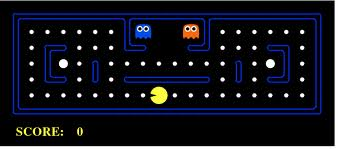
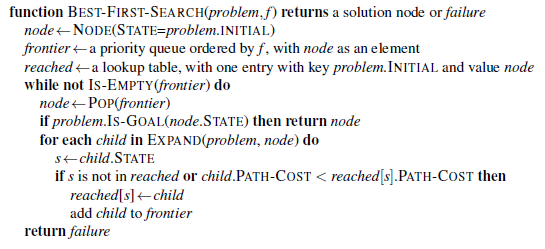
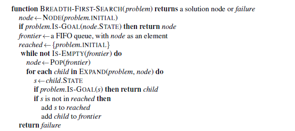
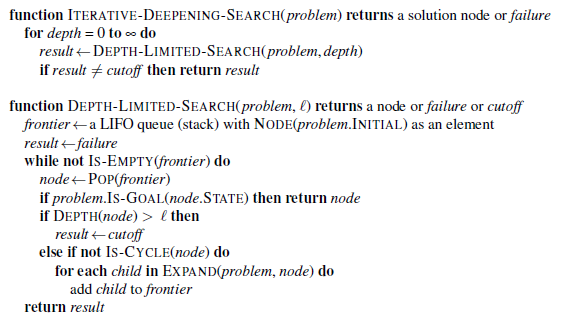

# RMIT COSC3117/1127 AI'25 - Project 1 - Search

You **must read fully and carefully** the assignment specification and instructions detailed in this file. You are NOT to modify this file in any way, except if instructed by the teaching staff in writing.

* **Course:** [COSC1127/3117 Artificial Intelligence](http://www1.rmit.edu.au/courses/004123) @ Semester 2, 2025
* **Instructor:** Prof. Sebastian Sardina
* **Deadline:** Sunday August 17th, 2025 @ 11:59pm (end of Week 4)
* **Course Weight:** 10%
* **Assignment type:** Individual
* **CLOs covered:** 2, 3, 4 and 5
* **Submission method:** via git tagging (see below for instructions)

The **aim of this project** is to get you acquainted with AI search techniques and how to derive heuristics in Pacman, as well as to understand the Python-based Pacman infrastructure.

 <p align="center"> 
    
        
 </p>
  
> [!IMPORTANT]  
> 
> **About this repo:** You must ALWAYS keep your fork **private** and **never share it** with anybody in or outside the course, _even after the course is completed_. You are not allowed to make another repository copy outside the provided GitHub Classroom without the written permission of the teaching staff. Please respect the authors request:
> 
> > **_Please do not distribute or post solutions to any of the projects._**
> 

<br>

- [RMIT COSC3117/1127 AI'25 - Project 1 - Search](#rmit-cosc31171127-ai25---project-1---search)
  - [Marking criteria ✅](#marking-criteria-)
  - [Your task 💁](#your-task-)
    - [Algorithms to use](#algorithms-to-use)
    - [Question 1 (3 pts): Finding a Fixed Food Dot using Depth First Search](#question-1-3-pts-finding-a-fixed-food-dot-using-depth-first-search)
    - [Question 2 (3 pts): Breadth First Search](#question-2-3-pts-breadth-first-search)
    - [Question 3 (3 pts): Varying the Cost Function](#question-3-3-pts-varying-the-cost-function)
    - [Question 4 (3 pts): A\* search](#question-4-3-pts-a-search)
    - [Question 5 (3 pts): Finding All the Corners](#question-5-3-pts-finding-all-the-corners)
    - [Question 6 (3 pts): Corners Problem: Heuristic](#question-6-3-pts-corners-problem-heuristic)
    - [Question 7 (5 pts): Eating All The Dots](#question-7-5-pts-eating-all-the-dots)
    - [Question 8 (3 pts): Suboptimal Search](#question-8-3-pts-suboptimal-search)
    - [Question 9 (8 points): Iterative Deepening](#question-9-8-points-iterative-deepening)
    - [Question 10 (4 points): Reflection](#question-10-4-points-reflection)
  - [Submission Instructions 📨](#submission-instructions-)
  - [Important information ❗](#important-information-)
  - [AI Code of Honour 🥇](#ai-code-of-honour-)
  - [Final Words... 🏁](#final-words-)
  - [Acknowledgements 🙏](#acknowledgements-)

## Marking criteria ✅

We will follow the weights specified in each task, and also consider the development quality for evidence of sustainable work towards the solution (not just the solution); see below. A feedback autograder is provided, but you should consider it as a **feedback** tool (i.e., a useful indication of your performance) and not as the ultimate mark. We reserve the right to run more tests, inspect your code and repo manually, and arrange for a face-to-face meeting for a discussion and demo of your solution if needed.

You must also **follow good SE practices**, including good use of git version control during your development such as:

* _Commit early, commit often:_ it is not good practice to make a single commit with all of the solution nor is it good practice to make very few commits each with big chunks of it.
* _Use meaningful commit messages:_ like comments in your code, the message should clearly summarise what the commit is about. Messages like "fix", "work", "commit", "changes" are poor and do not help us understand what was done.
* _Use atomic commits:_ avoid commits doing many things; let alone one commit solving many questions of the project. Each commit should be about one (little but interesting) thing. 

Please refer to the [SE and GIT Best Practices][SEGIT] information, including examples of quality development. 😉

> [!CAUTION]
> We will inspect the **commit history** for high-quality SE practices and evidence of _meaningful contributions_ 👌. The results of this check can affect the overall mark of the project and point deductions may be applied when poor SE practices have been used or no evidence of contributions and/or process can be found. For example, few commits with a lot of code changes, commits mixing different aspects (e.g., commits across different questions), poor non-meaningful commit messages (e.g., "update" or "changes"), file uploads, or unnecessary many commits may result in deductions, _even if the performance is excellent_. The commit history needs to **provide clear and easily accessible evidence how you worked towards your solution**; the process. For example, a single or very few bulk commits (which does not provide evidence of process and progress), will attract at most 20% of the overall marks. 

**We reserve the right to call individual interviews when needed.**


## Your task 💁

In this assessment, **your task** is to complete the ten exercise questions below based on the UC Berkeley Pacman Projects.

* ✅ You **must build and submit your solution** using the sample code we provide you in this repository, which is different from the original UCB code base. 

* 👀 You should **only work and modify** files `search.py`, `searchAgents.py` and `reflections.py` in doing your solution. Do not change any of the other Python files in this distribution.

* 💻 Your code **must run _error-free_ on Python 3.9+**. Staff will not debug/fix any code. Using a different version will risk your program not running with the Pacman infrastructure or autograder and may risk losing (all) marks. See also [these questions](https://github.com/RMIT-COSC1127-3117-AI25/AI25-DOC/blob/main/FAQ-PROJECTS.md#what-version-of-python-should-i-use) in the FAQ for more info. Make sure to **install the project dependencies**; refer to [this FAQ entry](https://github.com/RMIT-COSC1127-3117-AI25/AI25-DOC/blob/main/FAQ-PROJECTS.md#how-can-i-install-project-dependencies) for details.

* 🕛 Your solutions must run in **reasonable time** . When a question times out, zero marks will be awarded to the question. Consider that running the whole feedback autograder provided takes less than 0.5 seconds in total (i.e., all tests) in our cluster machines used for marking (not really fast CPUs), and less than 7 seconds on the full marking tests (which includes many other additional test cases).

* ⛔ You should **never tamper with the Pacman infrastructure**, neither at the source code level (e.g., changing files other than the ones for the task) nor at the run-time level (e.g., changing infrastructure properties or catching all exceptions with bare `except:` code). Check [this](https://github.com/RMIT-COSC1127-3117-AI25/AI25-DOC/blob/main/FAQ-PROJECTS.md#can-i-change-the-pacman-infrastructure-at-run-time) and [this](https://github.com/RMIT-COSC1127-3117-AI25/AI25-DOC/blob/main/FAQ-PROJECTS.md#can-i-use-catch-all-exceptions-in-my-code-or-exceptions-from-the-infrastructure) questions in the FAQ on this and ask if in doubt.

* 👍 You **must follow good SE practice** during you development; please refer to marking criteria below.

* 🏁 A **feedback autograder** is provided which includes some basic core tests (more will be run at marking time, refer to Marking Criteria below). You are free (and encouraged!) to **add additional testing scenarios** under the `test_case/` folder.

* ✉️ You must submit as per instructions below.

### Algorithms to use

There are **many** variations of these search algorithms which give **subtly different** results in lots of edge cases. Tests will be checking whether you have implemented a _particular_ search algorithm  accurately, not just that you are solving the search problem. You **must follow the original course book ([AIMA 4th Global Edition](http://aima.cs.berkeley.edu/global-index.html))** for your search algorithms.

> [!WARNING]
Implementing a different variant of the algorithm (including those on the book's web resources or previous editions) can result in less or no points awarded.

Specifically, for Q1, Q3, and Q4, **you must** implement the algorithm according to Figure 3.7:

 <p align="center"> 
    
 </p>


### Question 1 (3 pts): Finding a Fixed Food Dot using Depth First Search

In `searchAgents.py`, you’ll find a fully implemented `SearchAgent`, which plans out a path through Pacman’s world and then executes that path step-by-step. The search algorithms for formulating a plan are not implemented – that’s your job!

First, test that the `SearchAgent` is working correctly by running:

```shell
$ python pacman.py -l tinyMaze -p SearchAgent -a fn=tinyMazeSearch
```

The command above tells the `SearchAgent` to use `tinyMazeSearch` as its search algorithm, which is implemented in `search.py`. Pacman should navigate the maze successfully.

Now it’s **time to write full-fledged generic search** functions to help Pacman plan routes! Pseudocode for the search algorithms you’ll write are found above in [Algorithms to use](#algorithms-to-use) section. Remember that a search node must contain not only a state but also the information necessary to reconstruct the path (plan) which gets to that state.

> [!IMPORTANT]
> All of your search functions need to return a list of actions that will lead the agent from the start to the goal. These actions must be legal moves (i.e. valid directions, no moving through walls).
>
> You may find the data structures defined in `util.py` useful, though it is not necessary to use them. If you define your own (e.g., priority queue), remember they must be included in the files you are meant to modify (e.g., `search.py`), not elsewhere (changes outside will not be used and will have a negative impact on your solution performance and marks).

> [!TIP]
> Each algorithm is very similar. Algorithms for DFS, BFS, UCS, and A* differ only in the details of how the frontier is managed. So, concentrate on getting DFS right and the rest should be relatively straightforward. Indeed, one possible implementation requires only a single generic search method which is configured with an algorithm-specific queuing strategy. There are small variations of the algorithms, but remember your task is to adhere to the pseudocode in the [Algorithms to use](#algorithms-to-use) section.

Implement the depth-first search (DFS) algorithm in the `depthFirstSearch` function in `search.py`. To make your algorithm complete, write the graph search version of DFS, which avoids expanding any already visited states.

Your code should quickly find a solution for:

```shell
$ python pacman.py -l tinyMaze -p SearchAgent
$ python pacman.py -l mediumMaze -p SearchAgent
$ python pacman.py -l bigMaze -z .5 -p SearchAgent
```

The Pacman board will show an overlay of the states explored, and the order in which they were explored (brighter red means earlier exploration). Is the exploration order what you would have expected? Does Pacman actually go to all the explored squares on his way to the goal?

> [!TIP] 
> If you use a `Stack` as your data structure, the solution found by your DFS algorithm for `mediumMaze` should have a length of 130 (provided you push successors onto the fringe in the order provided by getSuccessors; you might get 246 if you push them in the reverse order). Is this a least cost solution? If not, think about what depth-first search is doing wrong.

Finally, you can run the complete feedback autograder on Q1 by running:

```shell
$ python autograder.py -q q1
```

### Question 2 (3 pts): Breadth First Search

Implement the breadth-first search (BFS) algorithm in the `breadthFirstSearch` function in `search.py`. Again, write a graph search algorithm that avoids expanding any already visited states. For this question, **you must** implement the algorithm according to Figure 3.9 in the book:

 <p align="center"> 
    
 </p>

Test your code the same way you did for depth-first search.

```shell
$ python pacman.py -l mediumMaze -p SearchAgent -a fn=bfs
$ python pacman.py -l bigMaze -p SearchAgent -a fn=bfs -z .5
```

Does BFS find a least cost solution? If not, check your implementation.

> [!TIP]
> If Pacman moves too slowly for you, try the option `–frameTime 0`.


If you’ve written your search code generically, your code should work equally well for the eight-puzzle search problem without any changes.

```shell
$ python eightpuzzle.py
```

Finally, you can run the complete feedback autograder on Q2 by running:

```shell
$ python autograder.py -q q2
```

### Question 3 (3 pts): Varying the Cost Function

While BFS will find a fewest-actions path to the goal, we might want to find paths that are “best” in other senses. Consider `mediumDottedMaze` and `mediumScaryMaze`.

By changing the cost function, we can encourage Pacman to find different paths. For example, we can charge more for dangerous steps in ghost-ridden areas or less for steps in food-rich areas, and a rational Pacman agent should adjust its behavior in response.

Implement the uniform-cost graph search algorithm in the `uniformCostSearch` function in `search.py`. We encourage you to look through `util.py` for some data structures that may be useful in your implementation. You should now observe successful behavior in all three of the following layouts, where the agents below are all UCS agents that differ only in the cost function they use (the agents and cost functions are written for you):

```shell
$ python pacman.py -l mediumMaze -p SearchAgent -a fn=ucs
$ python pacman.py -l mediumDottedMaze -p StayEastSearchAgent
$ python pacman.py -l mediumScaryMaze -p StayWestSearchAgent
```

> [!NOTE]
> You should get very low and very high path costs for the `StayEastSearchAgent` and `StayWestSearchAgent` respectively, due to their exponential cost functions (see `searchAgents.py` for details).

As above, you can run the feedback autograder for Q3 alone and check. Remember these are only some tests for feedback, but you can, and probably _should_, add your own additional test cases to test the full correctness of your solution.

### Question 4 (3 pts): A* search

Implement A* search in the empty function `aStarSearch` in `search.py`. A* takes a heuristic function as an argument. Heuristics take two arguments: a state in the search problem (the main argument), and the problem itself (for reference information). The `nullHeuristic` heuristic function in `search.py` is a trivial example.

You can test your A* implementation on the original problem of finding a path through a maze to a fixed position using the Manhattan distance heuristic (implemented already as `manhattanHeuristic` in `searchAgents.py`).

> [!TIP]
>  In addition to keeping track of the visited state, you may also want to keep track of the best path cost to that state so far. Some nodes may need to be expanded more than once to find the optimal path.

```shell
$ python pacman.py -l bigMaze -z .5 -p SearchAgent -a fn=astar,heuristic=manhattanHeuristic
```

You should see that A* finds the optimal solution slightly faster than uniform cost search (about 549 vs. 620 search nodes expanded in our implementation, but ties in priority may make your numbers differ slightly). What happens on `openMaze` for the various search strategies?

### Question 5 (3 pts): Finding All the Corners

The real power of A* will only be apparent with a more challenging search problem. Now, it’s time to formulate a new problem and design a heuristic for it.

In corner mazes, there are four dots, one in each corner. Our new search problem is to find the shortest path through the maze that touches all four corners (whether the maze actually has food there or not). Note that for some mazes like `tinyCorners`, the shortest path does not always go to the closest food first! **Hint:** the shortest path through `tinyCorners` takes 28 steps.

> [!IMPORTANT]
> Make sure to complete Question 2 before working on Question 5, because Question 5 builds upon your answer for Question 2.

Implement the `CornersProblem` search problem in `searchAgents.py`. You will need to choose a state representation that encodes all the information necessary to detect whether all four corners have been reached. Now, your search agent should solve:

```shell
$ python pacman.py -l tinyCorners -p SearchAgent -a fn=bfs,prob=CornersProblem
$ python pacman.py -l mediumCorners -p SearchAgent -a fn=bfs,prob=CornersProblem
```

To receive full credit, you need to define an abstract state representation that does not encode irrelevant information (like the position of ghosts, where extra food is, etc.). In particular, do not use a Pacman `GameState` as a search state. Your code will be very, very slow if you do (and also wrong).

An instance of the `CornersProblem` class represents an entire search problem, not a particular state. Particular states are returned by the functions you write, and your functions return a data structure of your choosing (e.g. tuple, set, etc.) that represents a state.

> [!TIP]
> The only parts of the game state you need to reference in your implementation are the starting Pacman position and the location of the four corners.

Our implementation of `breadthFirstSearch` expands just under 2000 search nodes on `mediumCorners`. However, heuristics (used with A* search) can reduce the amount of searching required.

As usual, use the feedback autograder and extend it with your own additional tests. 😉


### Question 6 (3 pts): Corners Problem: Heuristic

**Note:** Make sure to complete Question 4 before working on Question 6, because Question 6 builds upon your answer for Question 4.

Implement a non-trivial heuristic for the `CornersProblem` in `cornersHeuristic`.

```shell
$ python pacman.py -l mediumCorners -p AStarCornersAgent -z 0.5
```

**Note:** AStarCornersAgent is a shortcut for

```shell
-p SearchAgent -a fn=aStarSearch,prob=CornersProblem,heuristic=cornersHeuristic
```

**Admissibility:** Remember, heuristics are just functions that take search states and return numbers that estimate the cost to a nearest goal. More effective heuristics will return values closer to the actual goal costs. To be admissible, the heuristic values must be lower bounds on the actual shortest path cost to the nearest goal (and non-negative).

**Non-Trivial Heuristics:** The trivial heuristics are the ones that return zero everywhere (UCS) and the heuristic which computes the true completion cost. The former won’t save you any time, while the latter will timeout the autograder. You want a heuristic which reduces total compute time. 

**Grading:** Your heuristic must be a non-trivial non-negative heuristic to receive any points. Make sure that your heuristic returns 0 at every goal state and never returns a negative value. Depending on how few nodes your heuristic expands, you’ll be graded:

| Number of nodes expanded | Points |
| ------------------------ | ------ |
| more than 2000           | 0/3    |
| at most 2000             | 1/3    |
| at most 1600             | 2/3    |
| at most 1200             | 3/3    |
 	

> [!IMPORTANT]
> The final marking will check node counts, but will also enforce a reasonable time limit. The question is not only whether the heuristic reduces the number of expansions, but also whether this ultimately leads to less search time. Basically, you are after a good enough A* implementation and a heuristic that _significantly improves_ A* when used without heuristic. Refer to the questions on this in the [FAQ for Project 1][FAQ-P1].

### Question 7 (5 pts): Eating All The Dots

Now we’ll solve a hard search problem: eating all the Pacman food in as few steps as possible. For this, we’ll need a new search problem definition which formalizes the food-clearing problem: `FoodSearchProblem` in `searchAgents.py` (implemented for you). A solution is defined to be a path that collects all of the food in the Pacman world. For the present project, solutions do not take into account any ghosts or power pellets; solutions only depend on the placement of walls, regular food and Pacman (of course, ghosts can ruin the execution of a solution! We’ll get to that in the next project). If you have written your general search methods correctly, A* with a null heuristic (equivalent to uniform-cost search) should quickly find an optimal solution to `testSearch` (total cost of 7) with no code change on your part:

```shell
$ python pacman.py -l testSearch -p AStarFoodSearchAgent
```

> [!TIP]
> `AStarFoodSearchAgent` is a shortcut for:
> 
> ```
> -p SearchAgent -a fn=astar,prob=FoodSearchProblem,heuristic=foodHeuristic
> ```

You should find that UCS starts to slow down even for the seemingly simple `tinySearch`. As a reference, our implementation takes 2.5 seconds to find a path of length 27 after expanding 5057 search nodes.

> [!IMPORTANT] 
> Make sure to complete Question 4 before working on Question 7, because Question 7 builds upon your answer for Question 4.

Fill in `foodHeuristic` in `searchAgents.py` with a consistent heuristic for the `FoodSearchProblem`. Try your agent on the `trickySearch` board:

```shell
$ python pacman.py -l trickySearch -p AStarFoodSearchAgent
```

Our UCS agent finds the optimal solution in about 13 seconds, exploring over 16,000 nodes.

Any non-trivial non-negative consistent heuristic (running on reasonable time) will receive 1 point. Make sure that your heuristic returns 0 at every goal state and never returns a negative value. Depending on how few nodes your heuristic expands, you’ll get additional points:

 | Number of nodes expanded | Grade                         |
 | ------------------------ | ----------------------------- |
 | more than 15000          | 1/5                           |
 | at most 15000            | 2/5                           |
 | at most 12000            | 3/5                           |
 | at most 10000            | 4/5                           |
 | at most 9000             | 5/5 (full credit; medium)     |
 | at most 7000             | 6/5 (1 extra credit; hard)    |
 | at most 2000             | 7/5 (2 extra credits; harder) |
 
 
 > [!IMPORTANT]
 > As before, we are not just after heuristics that expand less nodes its own sake; the reduction in expansions must entail significantly improved execution times. Good heuristics will run below 1 second on our cluster machines (which are not very fast!) for the `trickySearch` problem. The final marking will account for both nodes expanded and execution time. Refer to the questions on this in the [FAQ for Project 1][FAQ-P1]. Also, remember that if your heuristic is inconsistent, you will receive no credit, and the feedback autograder will tell you so. 😉

### Question 8 (3 pts): Suboptimal Search

Sometimes, even with A* and a good heuristic, finding the optimal path through all the dots is hard. In these cases, we’d still like to find a reasonably good path, quickly. In this section, you’ll write an agent that always greedily eats the closest dot. `ClosestDotSearchAgent` is implemented for you in `searchAgents.py`, but it’s missing a key function that finds a path to the closest dot.

Implement the function `findPathToClosestDot` in `searchAgents.py`. Our agent solves this maze (suboptimally!) in under a second with a path cost of 350:

```python
$ python pacman.py -l bigSearch -p ClosestDotSearchAgent -z .5
```

> [!TIP]
> The quickest way to complete `findPathToClosestDot` is to fill in the `AnyFoodSearchProblem`, which is missing its goal test. Then, solve that problem with an appropriate search function. The solution should be very short!

Your `ClosestDotSearchAgent` won’t always find the shortest possible path through the maze. Make sure you understand why and try to come up with a small example where repeatedly going to the closest dot does not result in finding the shortest path for eating all the dots.

### Question 9 (8 points): Iterative Deepening

Implement the **Iterative Deepening** tree search algorithm as per the AIMA book Figure 3.12 (pseudocode below) by inserting your code into the `iterativeDeepeningSearch` function in the `search.py` file.

 <p align="center"> 
    
 </p>

You should be able to do preliminary testing of the algorithm using the following command:

```shell
$ python pacman.py -l tinyMaze -p SearchAgent -a fn=ids
```

Other layouts are available in the layouts directory and some preliminary test cases are in the feedback autograder, but remember you can (and should!) create your own layouts and test cases!

### Question 10 (4 points): Reflection

Now that you have finished the programming part of the assignment, it is time for a quick reflection to help tie practice back into theory 🤔 Please answer the following four questions:

<ol type="a">
  <li>Is the DFS implementation from Q1 space efficient?</li>
  <li>Could early-goal testing be implemented in Q3 UCS without sacrificing optimality?</li>
  <li>Which of the specified search algorithms (in Q1–4 and Q9) implement a tree search? </li>
  <li>Which of the specified search algorithms (in Q1–4 and Q9) implement early goal testing? </li>
</ol>

Place your answers in the `reflection.py` file under their respective functions. Ensure that you answer them with respect to the specific pseudocode provided, not any other variant. For 10a and 10b, you should return a single boolean value. For 10c and 10d, you should return a list of 5 boolean values: one for each search algorithm (in order from 1–4 and 9). Please note that you are not provided with automated tests for this question, for obvious reasons 😆

## Submission Instructions 📨

To **submit your assignment** you must complete the following steps:

1. Check that your solution runs error-free on Python 3.9+.
2. Tag the commit version you want to be submit with tag name `submission` (case sensitive) in the `main` remote branch.
    * The commit and tagging should be dated _before_ the deadline to avoid any late penalty.
    * Make sure your submission is merged into the `main` branch, which should contain your latest stable version. 
    * Make sure you _push_ the tag to the _remote_ repo.
    * Note that a _tag_ is a name given to a specific commit in your git history. It is  NOT a branch nor a commit message nor a release. If you create a branch, release, or commit message with the text "`submission`", that will not be counted as tags and no marking will be done.
    * Check the Project FAQ for more information on [tagging](https://github.com/RMIT-COSC1127-3117-AI25/AI25-DOC/blob/main/FAQ-PROJECTS.md#how-do-i-submit-my-project-solution-in-my-git-repository-via-tagging) and [re-tagging](https://github.com/RMIT-COSC1127-3117-AI25/AI25-DOC/blob/main/FAQ-PROJECTS.md#how-do-i-change-the-submission-tag-if-i-have-already-tagged-one-commit-for-submission).
3. Fill the [Project 1 Certification Form](https://forms.gle/84fWWKR1Gq3cLkmZ9).
   * You will need to sign in with a Google account, so that the response can be forwarded to you for your records and to save your answers as you fill it (just in case...). You can use your RMIT Google account or your private one. 
     * If you use your private account, we will link it to your student number, so please make sure you keep using the same email over the course.
   * You will get an email receipt after submitting the certification; please check it and keep it for your records.
   * Non-certified submissions will not be marked and will attract zero marks.


> [!WARNING]  
> Submissions not compatible with the instructions above will attract zero marks and do not warrant a re-submission. Staff will not debug or fix your submission. Read carefully and ask for help (in forum or drop-in lab) if needed.

## Important information ❗

**Corrections**: From time to time, students or staff find errors (e.g. typos, unclear instructions, etc.) in the assignment specification. In that case, a corrected version of this file will be produced, announced, and distributed for you to commit and push into your repository.  Because of that, you are NOT to modify this file in any way to avoid conflicts.

**Late submissions, extensions, and SPC**: A penalty of 10% of the maximum mark per calendar day will apply to late submissions; see [this question][LATE] in the course FAQs. Extensions will only be permitted in _exceptional_ circumstances; see [this][EXTENSION1] and [this][EXTENSION2] question in the course FAQs. In many cases, SPC will be handled with a pen & paper Equivalent Assessment with the instructor at a later date.

**Forum posting**: Do not ever post any information on the forum that may disclose how to solve a question or what the solution may be. You can only post assignment related questions for _clarification_ on what is being asked, for auxiliary programming tasks (e.g., how to sort a list of numbers in Python), or for generic issues and problems with the techniques studied in the course. Posts discussing possible solutions or strategies may directly be considered plagiarism; see above. If in doubt, do not post and ask your question to the lecturer or tutor instead (remember EdStem allows private posting).

**Academic Dishonesty**: Being an advanced course, we expect full professionalism and ethical conduct. 
Most students know the difference between helping others in their learning and cheating (or helping others cheat). Plagiarism is cheating, and is a serious offense. Please **don't let us down and risk our trust**. You must write your solutions by yourself in full. We trust you will do this; again, don't let us down. Once trust is broken, it is very hard to recover. If you nonetheless cheat and break our trust, we will pursue the strongest consequences available to us according to the **University Academic Integrity policy**. In a nutshell, **never look at solution done by others**, either inside (e.g. a classmate) or outside (e.g. the web) the course: **they have already done their learning, this is your opportunity**! If you refrain from this behavior, you are safe. Please make sure you read in full our [Academic Integrity FAQ](https://github.com/RMIT-COSC1127-3117-AI25/AI25-DOC/blob/main/ACADEMIC_INTEGRITY.md) and the entry: [in a code assignment/project, how do I make sure I do not go against academic integrity?](https://github.com/RMIT-COSC1127-3117-AI25/AI25-DOC/blob/main/CODE-INTEGRITY.md)

**We are here to help!** We are here to help you! But we don't know you need help unless you tell us. We expect reasonable effort from your side, but if you get stuck or have doubts, please seek help. We will run **drop-in lab sessions** to support these projects, so use them! While you have to be careful to not post spoilers in the forum, you can always ask general questions about the techniques that are required to solve the projects. If in doubt whether a question is appropriate, post a *private* post to the instructors (the instructors may make it public if they consider it safe).

**Silence Policy**: A silent policy will take effect **48 hours** before this assignment is due. This means that no question about this assignment will be answered, whether it is asked on the newsgroup, by email, or in person. Use the last 48 hours to wrap up and finish your project quietly as well as possible if you have not done so already. Remember it is not mandatory to complete the project by reaching a perfect state, try to cover as much as possible. By having some silence we reduce anxiety, last minute mistakes, and unreasonable expectations of others.

## AI Code of Honour 🥇

We expect every RMIT student taking this course to adhere to the **Code of Honour**, under which every learner-student should:

* Submit their own original work.
* Not share answers with others.
* Report suspected violations.
* Not engage in any other activities that will dishonestly improve their results or dishonestly improve or damage the results of others.

Unethical behaviour is extremely serious and consequences are painful for everyone. We expect enrolled students/learners to take full **ownership** of their work and **respect** the work of teachers and other students.

## Final Words... 🏁

After completing this project you should understand how to represent a domain and problem so that search algorithms can be used, as well as how various search algorithms, uninformed and informed ones, work. You should also understand how heuristics can speed up the search process and the challenges behind designing an adequate and useful heuristic.

**We hope you enjoy the project and learn from it**. Remember the [**Projects FAQ**](https://github.com/RMIT-COSC1127-3117-AI25/AI25-DOC/blob/main/FAQ-PROJECTS.md) is available to answer common questions you might have about this project. If you still **have doubts about the project or this specification**, do not hesitate to ask in the [EdStem Course Discussion Forum][EDSTEM] or at the drop-in lab. 🤝

<p align="center"> 
    
</p>


## Acknowledgements 🙏

This assignment is based on the set of **UC Pacman Projects**. We are very grateful to UC Berkeley CS188 for developing and sharing their system with us for teaching and learning purposes.


[SEGIT]: https://github.com/RMIT-COSC1127-3117-AI25/AI25-DOC/blob/main/SE-PRACTICES.md
[EDSTEM]: https://edstem.org/au/courses/25332/discussion
[EXTENSION1]: https://github.com/RMIT-COSC1127-3117-AI25/AI25-DOC/blob/main/FAQ-COURSE.md#can-i-get-an-extension-for-the-assessment
[EXTENSION2]: https://github.com/RMIT-COSC1127-3117-AI25/AI25-DOC/blob/main/FAQ-COURSE.md#i-am-very-busy-with-other-commitments-work-other-subjects-travel-etc-and-may-not-be-able-to-make-the-deadline-can-i-get-an-extension
[LATE]: (https://github.com/RMIT-COSC1127-3117-AI25/AI25-DOC/blob/main/FAQ-COURSE.md#can-i-submit-late-what-is-the-penalty)
[FAQ-P1]: https://github.com/RMIT-COSC1127-3117-AI25/AI25-DOC/blob/main/FAQ-PROJECTS.md#project-1
